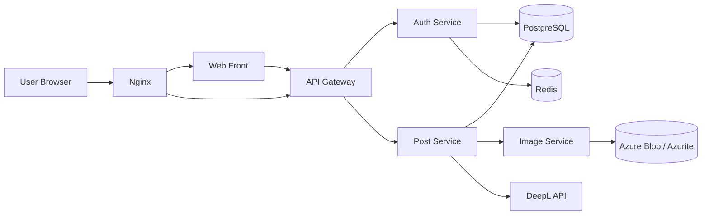

# PersonalWebSite

Multi-service personal blog platform built with Go, Gin, PostgreSQL, Redis, Nginx, and Docker Compose.

The repository is organized like a small production system rather than a single app:

- `web-front` serves SSR pages
- `api-gateway` centralizes authenticated API access
- `auth-service` handles Google OAuth, JWT issuance, and refresh-token rotation
- `post-service` manages posts, tags, image references, and async translation
- `img-service` manages image upload and deletion against blob storage

## Features

- Server-rendered blog pages and authoring UI
- Google OAuth login for the blog owner
- JWT access token validation at the API Gateway
- Refresh-token rotation backed by Redis
- Markdown-based post writing with image upload support
- Tag management for posts
- Asynchronous Korean-to-English translation for posts
- Azure Blob Storage support, with Azurite for local development
- Docker Compose based local and production-like environments
- Unit and integration tests across services

## Architecture



## Services

### `services/web-front`

- Renders HTML pages with Gin templates
- Provides blog list, article, login, edit, delete, about, and contact pages
- Sends browser requests to the API Gateway

### `services/api-gateway`

- Proxies `/v1/auth/*` and `/v1/posts*` style requests
- Validates access tokens for write operations
- Attempts refresh flow when an access token is expired

### `services/auth-service`

- Supports Google OAuth login and callback flow
- Issues access and refresh tokens
- Rotates refresh tokens
- Stores token revocation state in Redis
- Exposes user lookup and refresh endpoints

### `services/post-service`

- Creates, reads, updates, and deletes posts
- Manages tags
- Uploads embedded images and thumbnails through `img-service`
- Stores Korean source content as canonical content
- Translates title and content asynchronously when translation config is present

### `services/img-service`

- Uploads and deletes blog images
- Uses Azure Blob Storage in production
- Uses Azurite in local Docker development

### `pkg`

- Shared JWT, config, logging, and utility code

## Current Auth Model

This project does not currently expose a general email/password registration flow.

The implemented auth flow is:

1. User starts login from the web app
2. Browser is redirected to Google OAuth
3. `auth-service` validates the callback and issues cookies
4. `api-gateway` validates the access token on protected write routes
5. If the access token is expired, the gateway triggers refresh through `auth-service`

At the moment, Google OAuth login is effectively restricted to the configured owner account.

## Translation Behavior

`post-service` is designed so post creation and update do not block on translation.

- Post data is stored first
- Translation runs in a goroutine after persistence
- English title and content are written back later
- English content is stored as translated HTML

Translation depends on external API configuration. In practice, local and production-like runs need valid translation-related environment variables because the service config treats them as required.

## Key Routes

### Browser-facing routes

- `/`
- `/about`
- `/blog`
- `/blog/:articleNumber`
- `/blog-post`
- `/blog-edit/:articleNumber`
- `/blog-remove/:articleNumber`
- `/login`
- `/logout`
- `/oauth/google`

### Gateway API routes

- `GET /v1/posts`
- `GET /v1/posts/:id`
- `GET /v1/tags`
- `POST /v1/posts`
- `PUT /v1/posts/:id`
- `DELETE /v1/posts/:id`
- `POST /v1/auth/refresh`
- `GET /v1/auth/oauth/google/login`
- `GET /v1/auth/oauth/google/callback`
- `GET /v1/auth/users/:id`
- `PUT /v1/auth/users/:id`

## Local Development

### Prerequisites

- Docker
- Docker Compose
- Google OAuth credentials
- DeepL API key if translation is enabled

### Environment files

The repository includes:

- `.env.dev`
- `.env.prod`

Before running locally, review `.env.dev` and make sure the values are appropriate for your environment. The services expect values such as:

- `POSTGRE_CONNECTION_STRING`
- `JWT_SECRET_KEY`
- `GOOGLE_CLIENT_ID`
- `GOOGLE_CLIENT_SECRET`
- `MYDOMAIN`
- `TRANSLATION_API_URL`
- `TRANSLATION_API_KEY`
- `AZURE_STORAGE_CONNECTION_STRING`
- `BLOB_CONTAINER_NAME`

### Run development stack

```bash
docker compose -f docker-compose.dev.yml up --build
```

Access the site at:

- `http://localhost:3000`

### Run production-like stack

```bash
docker compose -f docker-compose.prod.yml up --build -d
```

## Testing

Run tests per Go module:

```bash
cd pkg && go test ./...
cd services/api-gateway && go test ./...
cd services/auth-service && go test ./...
cd services/img-service && go test ./...
cd services/post-service && go test ./...
cd services/web-front && go test ./...
```

CI runs tests before Docker image build and push.

## Repository Structure

```text
.
├── .github/workflows/
├── pkg/
├── services/
│   ├── api-gateway/
│   ├── auth-service/
│   ├── img-service/
│   ├── post-service/
│   └── web-front/
├── docker-compose.dev.yml
├── docker-compose.prod.yml
├── nginx.conf
├── nginx.prod.conf
└── README.md
```

## Design Notes

- Authentication enforcement is centralized in the API Gateway for protected write routes.
- Translation is async to keep authoring latency predictable.
- Image concerns are isolated from post domain logic.
- Repository tests use `sqlmock` for deterministic query-level testing.
- Docker Compose provides a full local stack, including PostgreSQL, Redis, Nginx, and Azurite.

## Contact

Seung Pyo Lee  
`lspyo11@gmail.com`
